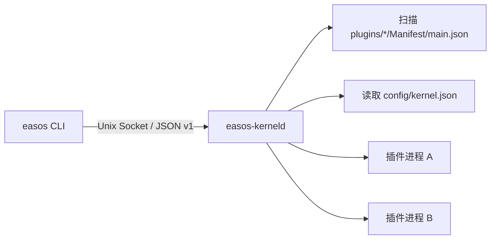

# EasOS Kernel

EasOS Kernel 是一个极简、动态可插拔的进程型微服务启动器。Kernel 只负责插件发现、安装、卸载、启动、停止和配置；业务能力全部由插件提供。

## 结构



Kernel 不维护“已安装插件列表”。目录存在且 `Manifest/main.json` 合法，即为已安装。

```text
/var/lib/easos/                    # 映射到宿主机 ./runtime
├── plugins/
│   ├── kernel/                    # 受保护的内置插件
│   │   ├── Manifest/main.json
│   │   └── bin/
│   │       ├── easos              # CLI 实体文件
│   │       └── easos-kerneld      # 常驻进程实体文件
│   └── <plugin-id>/
│       ├── Manifest/main.json
│       └── ...
├── config/kernel.json             # 自动启动与插件设置
├── run/kernel.sock                # CLI 控制通道
├── run/plugins/<id>/config.json   # 单次启动的只读配置快照
└── logs/<id>.log
```

## 在 Debian 容器中运行

宿主机不运行 Kernel，也不需要 Rust。构建与运行镜像均基于 Debian。首次启动：

```bash
docker compose up --build -d
docker compose exec kernel easos list
```

`./runtime` 直接映射到容器 `/var/lib/easos`。修改该目录内的插件文件，容器立即可见；修改 Rust 源码后执行 `docker compose up --build -d` 生成新的 Linux 二进制。`run/` 单独使用容器 tmpfs，避免把 Unix Socket 和运行时快照错误持久化到宿主机文件系统。

容器启动时会把最新版二进制安装到 `plugins/kernel/bin`，并创建：

```text
/usr/local/bin/easos -> /var/lib/easos/plugins/kernel/bin/easos
```

Compose 使用 `restart: unless-stopped` 保证容器随 Docker 恢复。非容器 Debian 部署可使用 `packaging/install.sh --enable-systemd` 安装并启用 `easos-kernel.service`。

## CLI

```bash
easos list
easos install /workspace/examples/plugins/clock
easos start clock
easos status clock
easos config clock set timezone '"Asia/Tokyo"'
easos autostart clock enable
easos stop clock
easos uninstall clock
```

所有命令输出结构化 JSON，便于脚本和后续管理插件复用。

## V1 边界

- 一个插件对应一个子进程，工作目录就是插件目录。
- `kernel` 是受保护的内置插件身份，不能通过 CLI 启停或卸载。
- 启动插件时按 `requires` 递归启动依赖；有运行中依赖方时不能停止，有已安装依赖方时不能卸载。
- 运行时配置通过 `EASOS_PLUGIN_CONFIG_PATH` 传给插件，修改设置后下次启动生效。
- CLI 控制使用 Unix Domain Socket；插件间业务调用协议不塞进 V1 生命周期内核，后续单独以 SDK + SocketPair 演进。
- V1 默认插件可信，不提供权限隔离、资源配额、在线升级和崩溃自动拉起。

数据结构与约束见 [docs/data-model.md](docs/data-model.md)。
