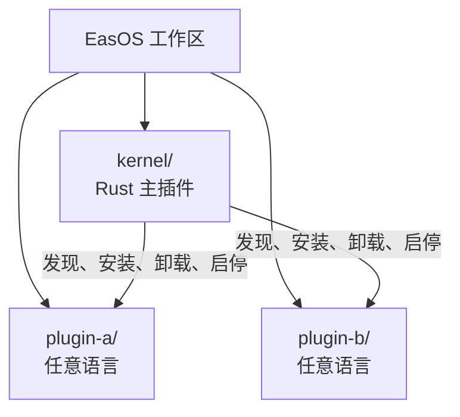
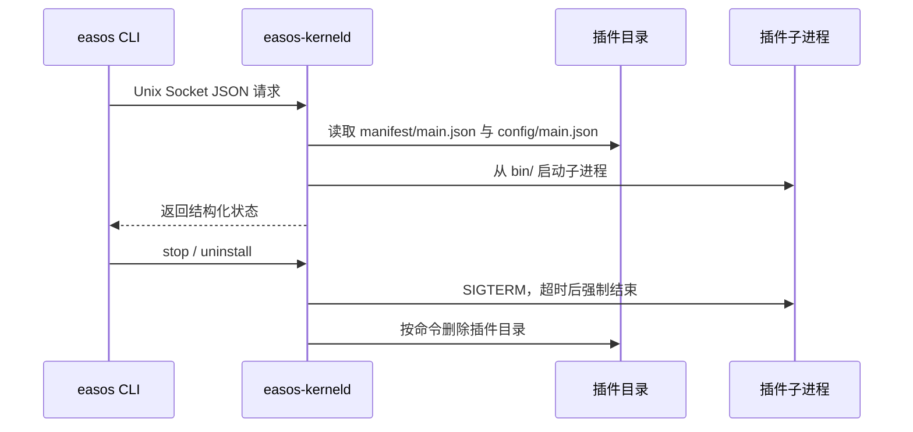
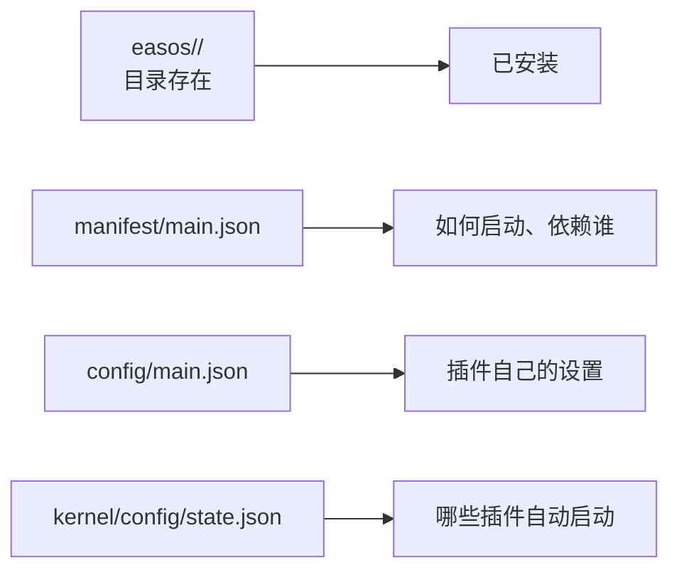
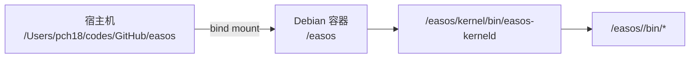
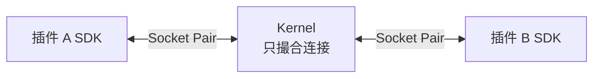

# EasOS 极简可插拔微服务架构

> 最终收口版 · 2026-08-18
> 只保留最新结论；已推翻的会议观点不进入本设计。

## 1. 一句话模型

> **EasOS 是一个插件工作区；Kernel 是管理插件进程生命周期的主插件。**



口述中的“K8s”按职责纠正为 **Kernel**，不是 Kubernetes。这里没有集群调度、服务网格或控制面。

## 2. 唯一目录模型

```text
easos/                              # 工作区；本身不作为仓库
├── kernel/                         # 主插件；独立仓库
│   ├── manifest/main.json
│   ├── source/
│   ├── bin/
│   ├── config/
│   └── docs/
└── <plugin-id>/                    # 普通插件；可独立仓库
    ├── manifest/main.json
    ├── source/                     # 开发态可选
    ├── bin/
    ├── config/main.json
    └── docs/                       # 开发态可选
```

规则只有四条：

1. `easos/` 的每个一级目录都是插件，不增加 `plugins/` 包装层。
2. `manifest/main.json` 是 Kernel 唯一必读的主清单；其他 Manifest 可并列存在，Kernel V1 不解析。
3. `bin/` 和 `config/` 在开发、生产环境都存在；`source/`、`docs/` 可在生产包中省略。
4. 目录就是安装事实：挂载整个工作区，等于让 Kernel 看见全部已安装插件。

## 3. Kernel 边界

| Kernel 负责 | Kernel 不负责 |
|---|---|
| 扫描并校验插件目录 | 业务逻辑 |
| 安装、卸载 | GUI、用户、数据库、日志平台 |
| 启动、停止、回收子进程 | 多节点调度与 Kubernetes 能力 |
| 自动启动列表 | 插件市场与远程下载 |
| CLI 控制通道 | V1 插件间 RPC |

判断标准：不影响“插件能否被发现并正确启停”的能力，一律放到插件或后续 SDK，不进入 Kernel。

## 4. 当前 V1 运行闭环



安装和启动是两个动作：

- 安装：把合法插件目录复制到 `easos/<plugin-id>/`，默认不启动。
- 启动：读取依赖，按顺序拉起 `bin/` 中声明的进程。
- 停止：存在运行中的依赖方时拒绝；否则优雅停止，超时后终止。
- 卸载：插件未运行且没有已安装依赖方时删除目录，并清理自动启动状态。

`kernel` 是受保护主插件，不能通过 CLI 启动、停止或卸载。

## 5. 三个事实源



这些信息不重复存储：

- 不维护“已安装插件数据库”。
- Kernel 不集中保存其他插件的业务配置。
- 自动启动状态只保存插件 ID 列表。
- Socket、PID、日志位于 `/run/easos`，不污染插件工作区。

## 6. 开发与生产

| 项目 | 开发目录 | 生产目录 |
|---|---:|---:|
| `manifest/` | 必须 | 必须 |
| `bin/` | 必须 | 必须 |
| `config/` | 必须 | 必须 |
| `source/` | 可选/通常存在 | 省略 |
| `docs/` | 可选/通常存在 | 省略 |

容器直接映射完整工作区：



修改宿主机插件目录，容器立即可见；修改 Rust 源码后重建镜像，入口脚本把新 Linux 产物安装回 `kernel/bin/`。宿主机不直接执行 Kernel。

## 7. 下一阶段：Socket Pair 与 SDK

V1 先验证生命周期，不提前实现业务 RPC。下一阶段保持同一进程模型：



最小路线：

1. Kernel 创建 Socket Pair，把子端作为固定 FD 交给插件进程。
2. SDK 定义稳定的帧头：版本、消息类型、请求 ID、服务、方法、超时、负载。
3. Go SDK 先实现连接、请求关联、超时、取消和错误码；其他语言遵守同一协议。
4. Kernel 只管理连接与调用关系，不理解业务 payload。

在生命周期闭环稳定前，不引入 Protobuf 路由中心、权限平台、服务网格或多节点调度。

## 8. 合理性检查

| 设计 | 结论 |
|---|---|
| 一级目录即插件 | 合理；安装状态直观，没有注册表双写 |
| Kernel 也是插件 | 合理；自身产物、配置和文档遵守同一契约 |
| 开发目录直接可运行 | 合理；减少打包与调试路径差异 |
| 运行态放 `/run/easos` | 合理；Socket、PID、日志不成为插件内容 |
| V1 只做生命周期 | 合理；先验证最小闭环，避免过早复杂化 |
| 目录复制安装 | 当前规模合理；未来再增加签名、版本和原子升级 |

## 9. V1 验收

- `easos/` 根目录没有非插件目录。
- 合法插件必须具备 `manifest/main.json`、`bin/`、`config/main.json`。
- 映射完整工作区后，Kernel 能发现所有插件。
- 安装后默认不启动；启动、停止、卸载形成闭环。
- 自动启动与插件设置重启后保持。
- Rust 构建、测试、Kernel 运行只发生在 Debian 容器内。
- Socket Pair 与 SDK 保持清晰接口，但不混入当前生命周期实现。
