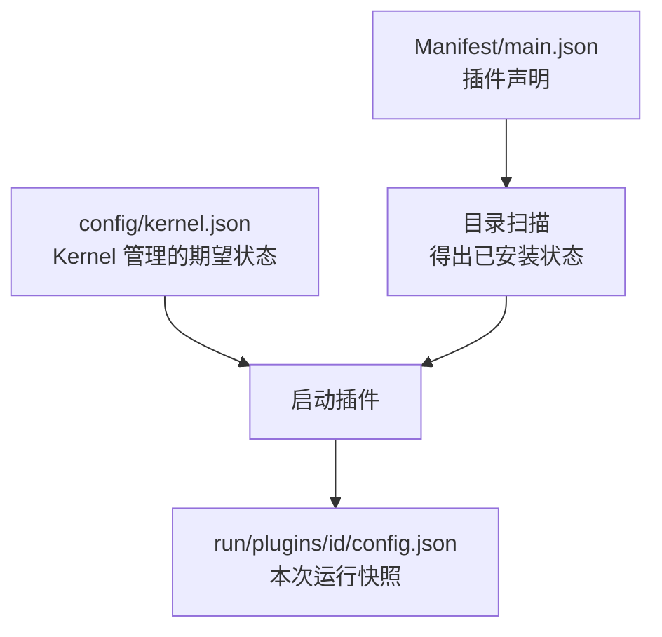

# V1 数据结构

V1 只保留三个持久化/运行时事实源。



## 1. Plugin Manifest

位置：`plugins/<id>/Manifest/main.json`

```json
{
  "schema_version": 1,
  "id": "clock",
  "name": "Example Clock",
  "version": "0.1.0",
  "kind": "process",
  "runtime": {
    "entrypoint": "bin/service",
    "args": [],
    "environment": {},
    "stop_timeout_ms": 3000
  },
  "provides": ["example.clock.v1"],
  "requires": ["kernel"]
}
```

| 字段 | 类型 | 约束 |
|---|---|---|
| `schema_version` | `u32` | V1 固定为 `1` |
| `id` | string | 1–64 位；字母、数字、`.`、`-`、`_`；必须与目录名相同 |
| `name` | string | 非空展示名 |
| `version` | semver | 插件实现版本，不参与安装状态判断 |
| `kind` | enum | `kernel` 固定为 `builtin`；普通插件固定为 `process` |
| `runtime.entrypoint` | relative path | 只能位于插件目录内 |
| `runtime.args` | string[] | 启动参数 |
| `runtime.environment` | map<string,string> | 插件专属环境变量 |
| `runtime.stop_timeout_ms` | u64 | `1..=60000`，超时后强制结束 |
| `provides` | string[] | 对外能力标识，V1 仅声明 |
| `requires` | plugin-id[] | 启动顺序和停卸保护依赖 |

规则：未知字段直接拒绝；`process` 必须有 `runtime`；`builtin` 仅保留给受保护的 `kernel` 且不能有 `runtime`；包内不接受符号链接。

## 2. Kernel Config

位置：`config/kernel.json`

```json
{
  "schema_version": 1,
  "plugins": {
    "kernel": {
      "autostart": true,
      "settings": {}
    },
    "clock": {
      "autostart": false,
      "settings": {
        "timezone": "Asia/Tokyo"
      }
    }
  }
}
```

`plugins` 是配置映射，不是安装清单。手工删除插件目录后，对应配置即使暂时残留，也不会让插件变成“已安装”；CLI 卸载会同步清理它。

## 3. Runtime Config Snapshot

位置：`run/plugins/<id>/config.json`

```json
{
  "schema_version": 1,
  "plugin_id": "clock",
  "settings": {
    "timezone": "Asia/Tokyo"
  }
}
```

Kernel 在每次启动前原子生成该文件，并通过 `EASOS_PLUGIN_CONFIG_PATH` 传递路径。插件只读，不反写 Kernel 配置。

## 4. CLI 控制协议

传输：本机 Unix Domain Socket `run/kernel.sock`，权限 `0600`；一行一个 JSON 请求/响应，最大 1 MiB。

请求：

```json
{
  "protocol_version": 1,
  "command": "start",
  "id": "clock"
}
```

成功响应：

```json
{
  "protocol_version": 1,
  "ok": true,
  "data": {
    "type": "plugin",
    "value": {}
  }
}
```

失败响应：

```json
{
  "protocol_version": 1,
  "ok": false,
  "error": {
    "code": "NOT_FOUND",
    "message": "plugin not found: clock"
  }
}
```

## 5. 后续插件间调用

生命周期控制通道与业务调用通道分开。下一阶段由 Kernel 为一次服务连接创建 `SocketPair`，把两端分别交给调用方和服务方；SDK 负责帧结构、请求 ID、超时、错误码与版本协商。Kernel 只做发现和连接撮合，不解析业务负载。

建议首版帧头固定为：

| 字段 | 类型 | 作用 |
|---|---|---|
| `protocol_version` | `u16` | SDK 协议版本 |
| `message_type` | `u8` | request / response / event / cancel |
| `request_id` | `u64` | 请求关联 |
| `service` | string | `provides` 中声明的能力 |
| `method` | string | 服务方法 |
| `deadline_unix_ms` | `u64?` | 超时边界 |
| `payload` | bytes | 业务负载；V1 SDK 可先用 JSON |

这部分暂不写入 Kernel V1 代码，避免把生命周期内核与业务 RPC 绑定。
